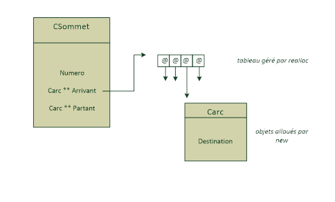
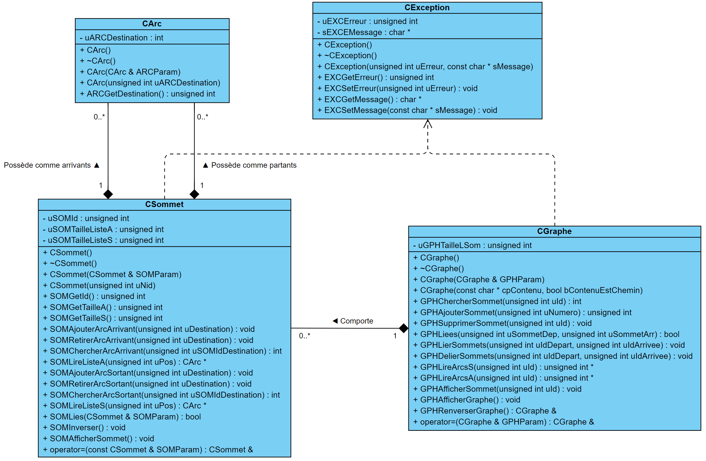

Projet tutoré 3 - Graphes
============= 

## Table des matières

- [1. Introduction](#1-introduction)
  - [1.1. Spécifications générales du projet (issues du sujet)](#11-spécifications-générales-du-projet-issues-du-sujet)
  - [1.2. Spécifications lecture d'un graphe depuis un fichier](#12-spécifications-lecture-dun-graphe-depuis-un-fichier)
- [2. Choix techniques](#2-choix-techniques)
  - [2.1. Architecture UML](#21-architecture-uml)
  - [2.2. Développement](#22-développement)
- [3. Manuel d’utilisation](#3-manuel-dutilisation)
- [4. Contributeurs](#4-contributeurs)

<br/>

## 1. Introduction

L’objectif est de réaliser une librairie de classes et fonctions permettant de manipuler des graphes.

<br/>

### 1.1. Spécifications générales du projet (issues du sujet)

> Dans ce projet tuteuré, nous allons mettre en place toutes les classes permettant de créer, modifier et accéder à un graphe orienté.  Pour cela nous allons créer 4 classes : 
> 1.	<b><ins>La classe CException :</ins></b> qui permettra de lever des exceptions,
> 2.	<b><ins>La classe CArc :</ins></b> qui représentera des arcs dans le graphe,
> 3.	<b><ins>La classe CSommet :</ins></b> qui représentera des sommets dans le graphe,
> 4.	<b><ins>La classe CGraphe :</ins></b> qui représentera un graphe.
> 
> Dans votre projet on supposera qu’aucune information particulière n’est stockée au niveau des sommets et des arcs.
>
> Dans la classe Carc, il n’y a qu’un seul attribut : le numéro du sommet destination (nommons le Destination).
>
> Dans la classe Csommet, il y a trois attributs : le numéro du sommet, la liste des arcs partants du sommet et la liste des arcs arrivants au sommet. Ces deux listes d’objets devront être gérées dynamiquement.
> Je vous propose l’implémentation suivante : 
<div align="center">
    
</div>
<br/>

### 1.2. Spécifications lecture d'un graphe depuis un fichier

Vous devrez développer une fonction qui permet de lire le contenu d’un graphe dans un fichier texte et créer un objet graphe en mémoire pour stocker les données lues dans le fichier. Le format du fichier texte (imposé) est donné ci-dessous

```
NBSommets=<Nombre_de_Sommets_du_graphe>
NBArcs=< Nombre_d_arcs_du_graphe >
Sommets=[
Numero=<Numéro_sommet >
Numero=<Numéro_sommet>
…
Numero=<Numéro_sommet>
]
Arcs=[
Debut=<Sommet_départ_arc>, Fin=<Sommet_arrivée_arc>
Debut=<Sommet_départ_arc>, Fin=<Sommet_arrivée_arc>
…
Debut=<Sommet_départ_arc>, Fin=<Sommet_arrivée_arc>
]
```
Un exemple :
```
NBSommets=3
NBArcs=3
Sommets=[
Numero=1
Numero=2
Numero=3
]
Arcs=[
Debut=1, Fin=2
Debut=2, Fin=3
Debut=3, Fin=1
]
```
<br/>

<i><ins>N.B. :</ins></i> 
<i>Le format du fichier contenant le graphe doit alors correspondre à l'expression régulière :
```r
/NBSommets[ \t]*=[ \t]*([0-9]+)[ \t]*\nNBArcs[ \t]*=[ \t]*([0-9]+)[ \t]*\nSommets[ \t]*=[ \t]*(\[)[ \t]*\n((?:Numero[ \t]*=[ \t]*[0-9]+\n)*)\][ \t]*\nArcs[ \t]*=[ \t]*(\[)[ \t]*\n((?:Debut[ \t]*=[ \t]*[0-9]+[ \t]*,[ \t]*Fin[ \t]*=[ \t]*([0-9]+)[ \t]*\n)*)\]\s*/
```
Utiliser [regexr.com/5rvv4](https://regexr.com/5rvv4) pour vérifier qu'un fichier convient au format demandé.<br/><br/>
Plus d'exemples sont disponibles dans le dossier [`Fichiers Test/`](Fichiers%20Test/).<br/>
Les fichiers `TestX_OK.txt` sont des fichiers bien formattés pour la création d'un graphe selon le modèle vu précédemment. Ce n'est en revanche pas le cas des fichiers `TestX_KO.txt` qui crérons une erreur lors de leur traitement.</i>


<br/>

## 2. Choix techniques

### 2.1. Architecture UML

Après analyse du sujet, nous avons réaliser le schéma UML suivant :
<div align="center">
  
</div>
<br/>

### 2.2. Développement 
| Nom de classe  |   <p align="center">Description</p>   |
| :------------: | ------------------------------------- |
|    <b><ins>[`CGraphe`](https://elambert-guillau.me/projet-tutore-3-graphes/class_c_graphe.html)</ins></b> | Cette classe nous permet de gérer directement tout ce qui concerne un graphe, à savoir : <ul><li>Gérer les sommets du graphe gestion (ajouter/modifier/supprimer)</li><li>Les accesseurs</li><li>Des fonctions intermédiaires nécessaires à l’élaborations de fonctionnalités attendues : lier/délier deux sommets, renverser le graphe...</li></ul> |
|    <b><ins>[`CSommet`](https://elambert-guillau.me/projet-tutore-3-graphes/class_c_sommet.html)</ins></b> | Cette classe nous permet de gérer directement tout ce qui concerne un sommet, à savoir : <ul><li>Gérer les arcs du sommet (ajouter/modifier/supprimer)</li><li>Les accesseurs</li><li>Des fonctions intermédiaires nécessaires à l’élaborations de fonctionnalités attendues</li></ul> |
| <b><ins>[`CException`](https://elambert-guillau.me/projet-tutore-3-graphes/class_c_exception.html)</ins></b> | Cette classe sert à créer des exceptions personnalisées |
|       <b><ins>[`CArc`](https://elambert-guillau.me/projet-tutore-3-graphes/class_c_arc.html)</ins></b> | Cette classe nous permet de gérer directement tout ce qui concerne un arc |

<br/>

## 3. Manuel d’utilisation

Il suffit simplement de passer un ou plusieurs chemins vers un/plusieurs fichier(s) contenant un graphe au format spécifié dans la partie "[1.2. Spécifications lecture d'un graphe depuis un fichier](#12-spécifications-lecture-dun-graphe-depuis-un-fichier)".
Par exemple si vous vous placez dans `C:/some/path/to/projet/projet-tutore-3-graphes/ProjetGraphes/Release/` vous pouvez lancer la commande :
~~~
start ProjetGraphes "../Fichiers Test/Test1_OK.txt" "../Fichiers Test/Test2_OK.txt" "../Fichiers Test/Test3_OK.txt" "../Fichiers Test/Test1_KO.txt" "../Fichiers Test/Test2_KO.txt" "../Fichiers Test/Test3_KO.txt" ""
~~~

<br/>

## 4. Contributeurs

* [Clément NONCHER-GILLET](mailto:clem.noncher.g@gmail.com)
* [Guillaume ELAMBERT](mailto:guillaume.elambert@yahoo.fr)